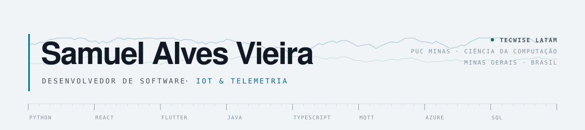
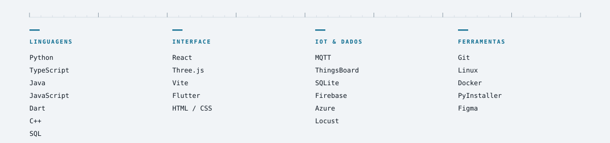
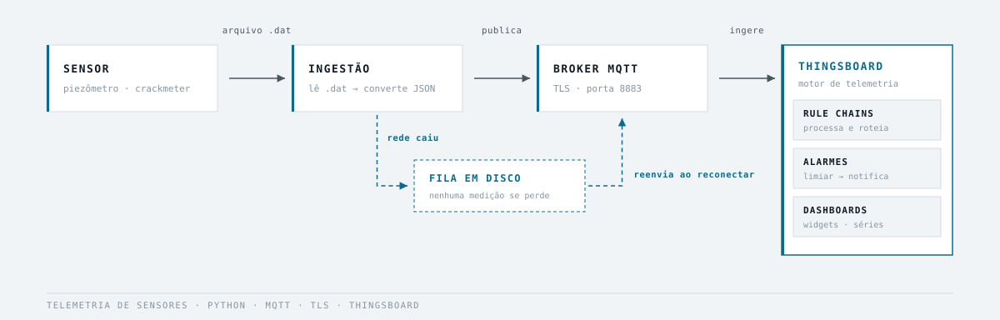

<picture>
  <source media="(prefers-color-scheme: dark)" srcset="./assets/banner-dark.svg">
  
</picture>

 

 

## Sobre

Estudante de **Ciência da Computação na PUC Minas**. Na
**[Tecwise Latam](https://br.linkedin.com/company/tecwiselatam)** trabalho com IoT e
monitoramento geotécnico: desenvolvo a ingestão de telemetria dos sensores em campo e
atuo no desenvolvimento do **TWMonitor**, a plataforma de monitoramento construída
sobre ThingsBoard, onde implemento rule chains, alarmes e dashboards.

Fora disso, construo o que me interessa — e é onde passo o tempo que sobra: um globo 3D
que digere livros de história, um app offline-first para oficina mecânica, um sistema de
análise financeira sem uma única dependência externa.

O que atravessa tudo é um gosto por software que continua correto quando as condições
não são ideais.

 

## Projetos

<table>
<tr>
<td width="50%" valign="top">

### [🌍 Globo Histórico Interativo](https://github.com/Samuelvieria/world-history-map)
**React 19 · TypeScript · Three.js · Python**

Globo 3D navegável onde eventos históricos viram pontos clicáveis, com navegação **mundo → continente → país → estado** e nível de detalhe progressivo.

Alimentado por um pipeline próprio que lê livros de história em PDF **sem usar LLM generativo** — modelos encoder que só apontam trechos existentes não conseguem fabricar um fato. Medido contra dois livros inteiros: **100% de proveniência íntegra em 2053 candidatos**.

</td>
<td width="50%" valign="top">

### 🔧 Screw — gestão para oficinas
**Flutter · Firebase · SQLite · Azure Vision** · 🔒 privado

App mobile **offline-first** para oficinas mecânicas: clientes, veículos, ordens de serviço e orçamentos em PDF. Grava local no SQLite e sincroniza sozinho com o Firestore quando a conexão volta. Inclui **leitura de placa por câmera (OCR)**.

Trabalho interdisciplinar em equipe de 6, em repositório fechado da PUC Minas.

`offline-first` · `sync` · `ocr` · `pdf`

</td>
</tr>
<tr>
<td width="50%" valign="top">

### 💰 Análise Financeira Empresarial
**Python (stdlib pura) · SQLite** · 🔒 privado

Importa extrato OFX, classifica lançamentos por regras que o usuário ensina, e apura **DRE, fluxo de caixa, depreciação, ponto de equilíbrio e Simples Nacional**. Aritmética em **centavos inteiros** — rateio sem perder um centavo. Zero dependências externas.

`fintech` · `ofx` · `contabilidade` · `zero-deps`

</td>
<td width="50%" valign="top">

### 🎬 VideosAut — pipeline de conteúdo
**Python · TTS · automação**

Pipeline por fases para produção de vídeo: roteiro, síntese de voz e render. Construído deliberadamente de trás pra frente — os primeiros vídeos são feitos à mão para descobrir o que funciona **antes** de automatizar qualquer etapa.

</td>
</tr>
</table>

### Também no ar

| Repositório | O que é |
|---|---|
| [**Engenharia de Software II**](https://github.com/Samuelvieria/Engenharia-De-software-II) | Sistema de biblioteca em Java — empréstimos, reservas e testes unitários com JUnit |
| [**TP AEDS III**](https://github.com/Samuelvieria/TP_AEDSIII) | Indexação e estruturas de dados em Java |
| [**DIW**](https://github.com/Samuelvieria/DIW) | Front-end de e-commerce em JS puro consumindo API REST |
| [**ACI**](https://github.com/Samuelvieria/ACI) | Circuitos digitais em Verilog |
| [**BD**](https://github.com/Samuelvieria/BD) | Modelagem relacional em MySQL e interface de acervo |

Os projetos marcados com 🔒 envolvem dados de clientes ou repositório fechado da universidade. Posso apresentá-los em conversa.

 

## Stack

<picture>
  <source media="(prefers-color-scheme: dark)" srcset="./assets/stack-dark.svg">
  
</picture>

 

## Um problema que eu gosto

<picture>
  <source media="(prefers-color-scheme: dark)" srcset="./assets/pipeline-dark.svg">
  
</picture>

Sensor em campo, rede instável. O caminho sólido é o dia bom; o tracejado é o que
importa: **quando a conexão cai, a medição vai para uma fila em disco e é reenviada
sozinha ao reconectar.**

Sem isso, cada instabilidade vira um buraco permanente na série temporal. Com isso,
vira um atraso. A diferença entre as duas parece pequena no código e é enorme para
quem depende do dado.

 

## Contato

